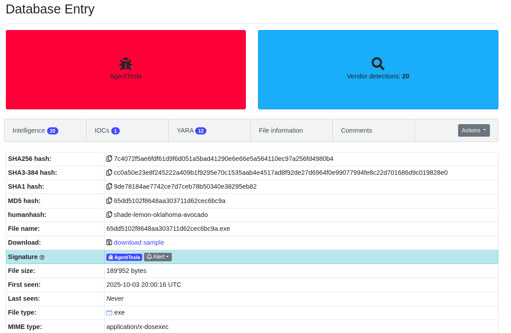
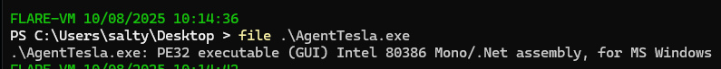
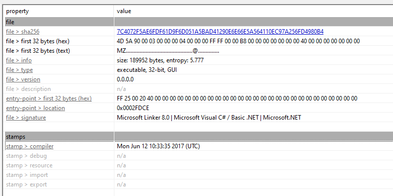
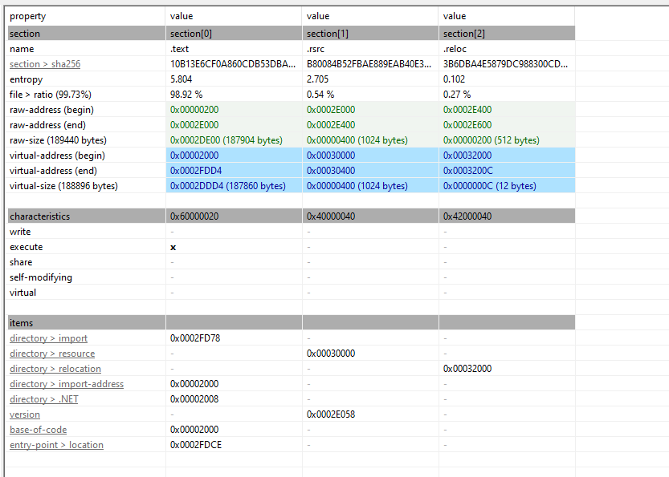
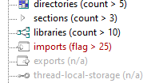
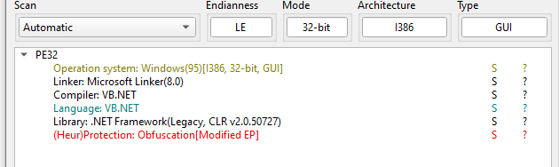
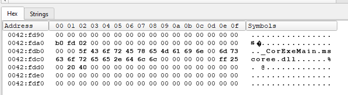
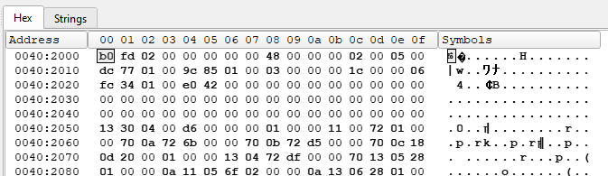
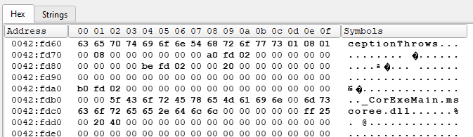

## Quick Summary
- Sample obtained from Malware Bazaar / Abuse.ch (collected Oct 8).
- Typical .NET infostealer / stealer characteristics: encrypted strings, registry persistence, keylogging hooks, clipboard monitoring, webcam/capture interfaces.
- Not packed (no extreme differences between raw and virtual section sizes) — obfuscation used (encrypted strings) rather than packers.
- Entry point shows an import/IAT-style jump; investigation shows it resolves to `_CorExeMain` (mscoree.dll) — consistent with .NET loader.
- IOCs and scripts included below (PowerShell decryptor + bulk decrypted strings link).
- Analysis tools used: PE Studio, Detect-It-Easy, FLOSS, VirusTotal, dnSpy, PowerShell, CyberChef

---

## Table of Contents
1. [Sample Information](#sample-information)
2. [Static Analysis](#static-analysis)
   - [Overview](#overview)
   - [FLOSS String Analysis](#floss-string-analysis)
   - [PE Studio Analysis](#pe-studio-analysis)
   - [Import Analysis & Notable Functions](#import-analysis--notable-functions)
3. [Behavioral Analysis](#behavioral-analysis)
   - [Detect-It-Easy Results](#detect-it-easy-results)
   - [Entry Point Investigation](#entry-point-investigation)
   - [dnSpy Observations & Deobfuscation Flow](#dnspy-observations--deobfuscation-flow)
4. [String Decryption](#string-decryption)
   - [PowerShell Decryptor (script)](#powershell-decryptor-script)
5. [Malware Flow & Observed Capabilities](#malware-flow--observed-capabilities)
6. [IOCs & References](#iocs--references)
7. [Conclusion](#conclusion)

---

## Sample Information

- **MD5:** `65dd5102f8648aa303711d62cec6bc9a`
- **File Size:** 185 KB
- **Source:** [Abuse.ch Bazaar](https://bazaar.abuse.ch/sample/7c4072f5ae6fdf61d9f6d051a5bad41290e6e66e5a564110ec97a256fd4980b4/)
- **VirusTotal:** [7c4072f5ae6fdf61d9f6d051a5bad41290e6e66e5a564110ec97a256fd4980b4](https://www.virustotal.com/gui/file/7c4072f5ae6fdf61d9f6d051a5bad41290e6e66e5a564110ec97a256fd4980b4)
- **Detailed outputs / artifacts:**
  - [floss_output.txt](floss_output.txt)
  - [agentTesla_string_decryptor.ps1](agentTesla_string_decryptor.ps1)
  - [decrypted_bulk_strings.txt.md](decrypted_bulk_strings.txt.md)

---

## Static Analysis

### Overview

#### Sample
Collected from Malware Bazaar (Abuse.ch). At collection time the file had a low VT detection score which increased over time.

#### File Analysis
- 185 KB .NET executable (32-bit).
- No obvious packer — raw and virtual section sizes show minimal differences.





### FLOSS String Analysis
Using FLOSS (FireEye Labs Obfuscated String Solver) produced many base64-looking strings and obfuscated content. A few notable extracted strings:

- `SOFTWARE\Microsoft\Windows NT\CurrentVersion` — registry path for system information.
- `C92S1PNJBD3LKYI0ZA58TG0R024KX5064SBEBQQT.exe` — potential dropped filename.

Refer to the full FLOSS output here: [floss_output.txt](floss_output.txt)

### PE Studio Analysis

#### Metadata


- **Architecture:** 32-bit executable
- **Compiler timestamp:** June 12, 2017; 10:33:35
- **File type:** .NET executable

#### Section Sizes


- No large discrepancy between raw and virtual sizes — suggests absence of heavy packing/compression.

### Import Analysis & Notable Functions


PE import + MemberRef analysis flags many functions typically abused by information stealers.

**Flagged imports (selected):**

| Function                 | Library         | Purpose / Usage                          |
|--------------------------|-----------------|-------------------------------------------|
| `DeleteFile`             | kernel32.dll    | File manipulation                         |
| `MoveFileExW`            | kernel32.dll    | File moves/replace                        |
| `CreateDirectory`        | mscoree.dll     | Create dirs (appdata / temp)              |
| `GetLastInputInfo`       | user32.dll      | User activity / idle detection            |
| `GetForegroundWindow`    | user32.dll      | Window monitoring                         |
| `GetWindowThreadProcessId`| user32.dll     | Map foreground window to process          |
| `GetKeyboardState`       | user32.dll      | Key state reading (keylogger)             |
| `SetWindowsHookExA`      | user32.dll      | Low-level hooking (keylogging)            |
| `capCreateCaptureWindowA`| avicap32.dll    | Webcam or capture window creation         |
| `SetKernelObjectSecurity`| advapi32.dll    | Privilege / security manipulation         |
| `GetEnvironmentVariable` | mscoree.dll     | .NET memberref usage for environment vars |
| `GetProcessesByName`     | mscoree.dll     | Process enumeration                       |
| `Send` / `DownloadFile`  | mscoree.dll     | Networking / exfil / C2 communication     |

**Applications of these imports** (high level): file handling, user activity monitoring, keylogging, clipboard monitoring, screen/webcam capture, privilege manipulation, process enumeration, network communication.

> This import set aligns strongly with an info-stealer / keylogger family such as AgentTesla.

---

## Behavioral Analysis

### Detect-It-Easy Results


- **Heuristic flag:** `Obfuscation[Modified EP]` — the EP (entry point) appears modified or uses an IAT-type jump; typical for obfuscated .NET binaries or loader stubs.

> **Entry Point Analysis:** The EP contains an import-based jump (`ff 25`) that resolves to an internal pointer. This often indicates a loader stub but is common in .NET binaries.

### Entry Point Investigation
- **Entry point address:** `0x0042fdce`
- Instruction bytes show an indirect jump (IAT thunk). Following the pointer led to a `_CorExeMain` call (mscoree.dll), confirming .NET runtime initialization rather than a custom packer.

Screenshots showing the EP hex and pointer resolution:





**Conclusion:** The entry behavior is consistent with a legitimate .NET loader / runtime jump — Detect-It-Easy flagged obfuscation but the EP resolves to `_CorExeMain`, so no immediate indication of a non-.NET loader.

### dnSpy Observations & Deobfuscation Flow
- Classes and method names are obfuscated.
- Using `de4dot.exe` helps produce a cleaner binary for analysis:

```bash
de4dot.exe calc.mal.exe -o clean.mal.exe
```

- After deobfuscation and loading into dnSpy, many strings are still encrypted and follow a pattern like decrypt_b64_AES(...). The binary uses a decryptor function to decode base64 + AES-like encrypted strings at runtime.


Example (decompiled C# snippet showing checks and decrypt usage):

```csharp
string osfullName = Class2.Class1_0.Info.OSFullName;
if (osfullName.Contains(<Module>.decrypt_b64_AES("jt4JXyzFY+P3zf6k/0mkCA==")) | ...)
{
    int num = Conversions.ToInteger(Class2.Class1_0.Registry.GetValue(
        <Module>.decrypt_b64_AES("K0ocYJdpSlFA..."),
        <Module>.decrypt_b64_AES("1jb8AudXf9ptWpuwzIAMvw=="),
        <Module>.decrypt_b64_AES("84htGJR8cIVATCAwL9pcMw=="))
    );
    ...
}
```

-> I wrote a PowerShell decryptor (agentTesla_string_decryptor.ps1) to run batch decryption against FLOSS output and discovered plaintext indicators (see decrypted_bulk_strings.txt.md).

---

## String Decryption

The sample contains many encrypted/base64 strings. I provide a PowerShell decryptor below that reflects the decryption routine used (as discovered in the binary). Use this for offline analysis of captured strings — do not execute malware.

### PowerShell Decryptor (script)

```powershell
# decrypt_dotnet.ps1
param([string[]]$Inputs)

$pwd = "amp4Z0wpKzJ5Cg0GDT5sJD0sMw0IDAsaGQ1Afik6NwXr6rrSEQE="
$saltText = "aGQ1Afik6NampDT5sJEQE4Z0wpsMw0IDAD06rrSswXrKzJ5Cg0G="
$iv = [System.Text.Encoding]::ASCII.GetBytes("@1B2c3D4e5F6g7H8")

function DecryptOne($b64) {
    try {
        $data = [Convert]::FromBase64String($b64)
    } catch {
        Write-Output "INPUT_NOT_BASE64: $b64";
        return
    }

    $saltBytes = [System.Text.Encoding]::ASCII.GetBytes($saltText)
    $pdb = New-Object System.Security.Cryptography.PasswordDeriveBytes($pwd,$saltBytes,"SHA1",2)
    $key = $pdb.GetBytes(32)

    $aes = New-Object System.Security.Cryptography.RijndaelManaged
    $aes.Mode = [System.Security.Cryptography.CipherMode]::CBC
    $dec = $aes.CreateDecryptor($key,$iv)

    try {
        $ms = New-Object System.IO.MemoryStream(,$data)
        $cs = New-Object System.Security.Cryptography.CryptoStream($ms,$dec,[System.Security.Cryptography.CryptoStreamMode]::Read)
        $buf = New-Object byte[] $data.Length
        $len = $cs.Read($buf,0,$buf.Length)
        $cs.Close(); $ms.Close()

        $txt = [System.Text.Encoding]::UTF8.GetString($buf,0,$len)
        if ($txt -match '^[\x20-\x7E\r\n\t]+$') {
            Write-Output "TEXT: $txt"
        } else {
            Write-Output ("HEX: " + ([BitConverter]::ToString($buf,0,$len) -replace '-',''))
        }
    } catch {
        try {
            $dec2 = ([System.Security.Cryptography.Rijndael]::Create()).CreateDecryptor($key,$iv)
            $plain = $dec2.TransformFinalBlock($data,0,$data.Length)
            $txt2 = [System.Text.Encoding]::UTF8.GetString($plain)
            if ($txt2 -match '^[\x20-\x7E\r\n\t]+$') {
                Write-Output "TEXT2: $txt2"
            } else {
                Write-Output ("HEX2: " + ([BitConverter]::ToString($plain) -replace '-',''))
            }
        } catch {
            Write-Output "DECRYPT_FAIL: $b64"
        }
    }
}

if (-not $Inputs) {
    Write-Output "Usage: .\decrypt_dotnet.ps1 <b64> [b64] ...";
    exit 1
}

foreach ($i in $Inputs) {
    Write-Output "----";
    Write-Output "INPUT: $i";
    DecryptOne $i
}
```
> Note: the above is included as a research artifact — do not run any sample on personal or valuable hardware. Use isolated and approved analysis labs with proper containment.


---

## Malware Flow & Observed Capabilities

### Setup & Persistence

- Checks / modifies UAC setting: HKEY_LOCAL_MACHINE\SOFTWARE\Microsoft\Windows\CurrentVersion\Policies\System\EnableLua — sets to 0 when present to disable UAC (observed behavior).

- Persistence via Software\Microsoft\Windows\CurrentVersion\Run — a subkey JavaUpdtr is created.

- Uses %appdata%\Java\JavaUpdtr.exe (hidden) as the installed filename and location.

- Creates temp/log directories to store captured data before exfiltration.


### Anti-analysis & Evasion

- Periodic process checks (runs a thread every ~5 minutes) for known AV / analysis tools and attempts to terminate or remove traces. Observed process names checked include (partial list):

  - `anubis`, `a2servic`, `ashWebSv`, `hvk`, `avgemc`, `bdagent`, `avp`, `keyscrambler`, `mbam`, `ekrn`


- Disables certain UI elements for the current user to reduce detection:

  - Task Manager, Control Panel, Regedit, Task Manager access, Run dialog, System Restore, Folder Options (hide extensions/hidden files), msconfig visibility.


### Data Collection & Capabilities

- Keylogging via `SetWindowsHookExA` and `GetKeyboardState`.

- Clipboard monitoring via `SetClipboardViewer` / `ChangeClipboardChain`.

- Screenshot / webcam capture via `capCreateCaptureWindowA` (`avicap32`).

- Process enumeration and environment collection via .NET memberrefs.

- Placeholder slots for C2-provided download links, SMTP/FTP endpoints — likely filled by C2 at runtime. Example observed URL (defanged in report):
`http://www.vacanzaimmobiliare[.]it/testla/WebPanel/post.php` — found in decrypted strings and flagged on VirusTotal.


---

## IOCs & References

### IOCs

-> MD5 : 65dd5102f8648aa303711d62cec6bc9a
-> FILE: C92S1PNJBD3LKYI0ZA58TG0R024KX5064SBEBQQT.exe
-> FILE: JavaUpdtr.exe
-> URL : http://www.vacanzaimmobiliare[.]it/testla/WebPanel/post.php


### Useful links

- 

- 

- 


---

## Conclusion

This AgentTesla sample demonstrates typical characteristics of .NET-based information stealers:

**Obfuscation:** Encrypted strings hide malicious logic and endpoints.

**Capabilities:** Keylogging, screenshot/webcam capture, clipboard monitoring, file manipulation, and persistence.

**Anti-analysis:** Periodic AV/tool checks; registry and UI modifications to hinder detection and recovery.

**Persistence:** Registry run key JavaUpdtr and placement under %appdata%\Java\.


-> The sample is consistent with a mature infostealer designed for stealth and data exfiltration rather than destructive operations. The use of a .NET runtime with AES/base64 string obfuscation indicates a well-developed tooling and deployment pipeline.
