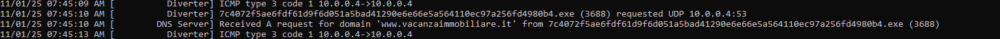
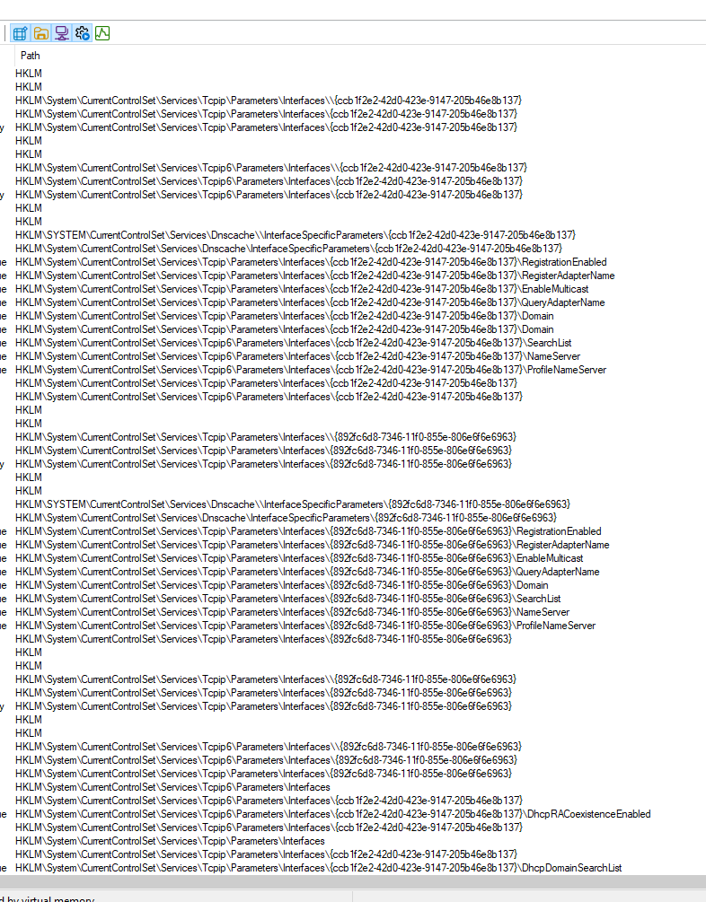
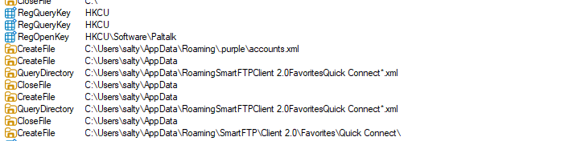
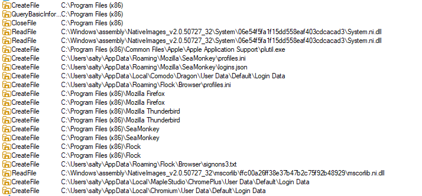
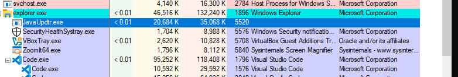
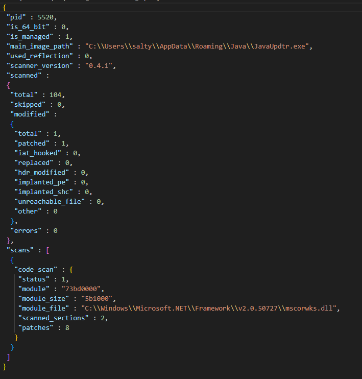

## Recap
In my Part 1 analysis, I established this sample as a highly aggressive, obfuscated .NET infostealer—Agent Tesla. My static efforts successfully broke its AES/Base64 string encryption, revealing a complex array of targeted applications and its primary C2 URL. Crucially, my dynamic scans, including the specialized PE-sieve run, confirmed active API hooking on the core .NET runtime library (mscorwks.dll) to achieve stealth and keylogging functionality. Now that I possess the full list of plaintext indicators and have defeated the sample's primary defense mechanisms, Part 2 will focus entirely on tracing the execution flow of the unpacked binary in dnSpy to map its credential harvesting logic, identify the full data exfiltration protocol, and finally expose the attacker’s complete configuration, including the specific email or FTP login credentials they used to receive the stolen data.  
  
---
  
## Table of Contents
1.  [Sample Information](#sample-information)
2.  [Breaking Down the Classes](#breaking-down-the-classes)
3.  [How it works?](#how-it-works)
   - [UAC Bypass](#uac-bypass)
   - [Persistence](#persistence)
   - [Anti-Everything](#anti-everything)
   - [Stealer](#stealer)
   - [Locked or Unused Stuff](#locked-or-unused-stuff)
4.  [Dynamic Analysis: Observing the Agent Tesla Payload](#dynamic-analysis-observing-the-agent-tesla-payload)
   - [Network Communication and Initial Contact](#network-communication-and-initial-contact)
   - [System Reconnaissance and Credential Theft](#system-reconnaissance-and-credential-theft)
   - [Persistence and Evasion Technique](#persistence-and-evasion-technique)
5.  [IOCs](#iocs)
  
----

## Sample Information

- **MD5:** `65dd5102f8648aa303711d62cec6bc9a`
- **File Size:** 185 KB
- **Source:** [Abuse.ch Bazaar](https://bazaar.abuse.ch/sample/7c4072f5ae6fdf61d9f6d051a5bad41290e6e66e5a564110ec97a256fd4980b4/)
- **VirusTotal:** [7c4072f5ae6fdf61d9f6d051a5bad41290e6e66e5a564110ec97a256fd4980b4](https://www.virustotal.com/gui/file/7c4072f5ae6fdf61d9f6d051a5bad41290e6e66e5a564110ec97a256fd4980b4)
- **Detailed outputs / artifacts:**
  - [floss_output.txt](floss_output.txt)
  - [agentTesla_string_decryptor.ps1](agentTesla_string_decryptor.ps1)
  - [decrypted_bulk_strings.txt.md](decrypted_bulk_strings.txt.md)

---
  
## Breaking Down the Classes  
Bellow is a high level overview of the various classes and what they are capable of doing. I have reverse engineering these with the help of DNSpy and assigned them these descriptive names.  
- **CredsExtractionHandler**  
    → Extracts credentials from discovered stores (calls browser/sqlite parsers, decryptors).  
- **CustomDeobfuscatore_ABCDEF**  
    → The custom token-based deobfuscator you analysed (A→10..F→15 mapping).  
- **InternalStrings**  
    → Data container/POCO for storing extracted strings/records (URL/user/pass).  
- **MachineHardwareIDHandler**  
    → Builds machine fingerprint (CPU ID + motherboard serial → MD5).  
- **Main**  
    → Program entry / high-level control flow (init, config, start timers/threads).  
- **Obfuscated_KERNEL32_And_ProcessHollowing_Handler**  
    → Dynamic API resolver + process-hollowing (create suspended, unmap, write sections, set context, resume).  
- **Restrict_Proc_Kill_or_Access_Handler**  
    → Modifies DACLs to deny access / inserts deny ACEs and can remove them; protects process from termination.  
- **Rijnael_Decryptor**  
    → AES/Rijndael decryption helper used for string/config decrypt.  
- **SafariHandler**  
    → Logic specific to Safari/Apple credential locations (parsing/decoding).  
- **SearchForBrowsers**  
    → Scans filesystem for browser profiles (Chrome, Edge, Opera, Brave, Safari paths).  
- **SQLite3Handler_Manual**  
    → Your in-house SQLite reader/parser used to read Login Data without SQLite lib.  
- **StealerUtilities**  
    → Helpers: file ops, encoding, padding, URL builders, registry helpers, I/O helpers.  
- **VariousBrowserGrabberHandler**  
    → High-level orchestration that calls per-browser handlers to extract creds/cookies/clipboard.  
  
---
  
## How it works?  
![[AgentTesla_Diagram.png]]  
  
-> The AgentTesla Malware-as-a-Service shows some signs of a typical "bundled" software with tiers and unlocks. It starts off by deleting any other instance of AgentTesla that is already running in the system. We will understand why this is required in a few moments. Once that is done, it runs a standard check using Windows Registry to make sure the current system is either a Windows 7, 8 or 10 system and exits if not.  Once these prerequisites are checked the malware starts the crucial **UAC Bypass**. This is a really interesting technique I got to learn from this sample, though it's quite common and an old mechanism, this was my first time understanding with a recent specimen.   
  
### UAC Bypass  
-> The malware checks the value for the registry key `HKEY_LOCAL_MACHINE\SOFTWARE\Microsoft\Windows\CurrentVersion\Policies\System\EnableLUA`, which can either be assigned 1 (True) or 0 (False). This value controls the **User Account Control**. Disabling this basically allows any process to run in full admin mode without depending on the security prompt. Many times you might have run programs that might need special privileges and you get a windows prompt with a blurred out/ darkened background on Windows. This key basically controls that additional layer of security prompt.   
-> With the **UAC** disabled, the malware then creates a new entry into the registry `SOFTWARE\Classes\mscfile\shell\open\command`. Within this key, a command is set as value, which invokes the current file (AgentTesla file itself) to be executed within a powershell process. This command within this key is triggered everytime a `.msc` files is opened up. `.msc` files are where all you system configurations are stored. These help administrators manage various system settings, resources and services.  
-> Why is this important? The malware then invoked `eventvwr.exe`. This is teh Windows Event Viewer, where users can view and monitor event logs in their system. This process opens up the `eventwr.msc` file. The moment this file is called, the command in the earlier registry key is triggered. Once triggered, the new AgentTesla process then spawn with full admin privileges as it inherits this from `eventvwr.exe`. The malware has now gained privileges and will not create any prompt for its processes as UAC is also disabled in the first step.   
  
### Persistence  
The malware clones itself onto `%APPDATA\JAVA\JavaUpdtr.exe` and sets the same path to the registry key `Software\Microsoft\Windows NT\CurrentVersion\Windows\Load`. This is a very old and well-known way of maintaining persistence. There was another registry being used, however that one was set to `Java Uptr`, which did not exactly make sense, and I have not added the registry key anywhere in this blog as well, so as to not confuse anyone, or myself even. Half knowledge is always dangerous.   
  
### Anti-Everything  
Using threading which loops and maintains the same checks and process every few seconds (most threads run at intervals of 5 seconds with a few 1 second interval threading), the sample kills processes with well-known names of a list of anti-virus, analysis and forensics and virtual machine based processes. This is to make it harder for others to analyze this file with ease. There was no critical anti-vm handling, where it immediately kills itself after a few vm checks, making it a little easier for me to handle the next phase of dynamic analysis.  
  
### Stealer  
-> The sample had a separate class filled with boolean values. This seemed like one of those bundled software touch, where each boolean would unlock or trigger a certain functionality in the stealer if it was set, for example boolean values to track whether data had to be exported to ftp, smtp or http interface, or whether an additional download was needed for additional stages (loader feature)
-> The sample has a set of complicated classes to handle stealing your data. It meticulously searches for each browser data available in your system. The list of browser it could handle was pretty extensive, and each of them seemed to be handled uniquely, without a haphazard automation class to handle searches for all browsers. Once detected, it would look into the standard directories where your cached login data and credentials would be stored. I did not dive too deep into each and every scraping mechanism for creds, but from what I understood, this sample of AgentTesla only handled browsers extensively and not other apps.
-> The sample also took screenshots, if this feature was set. These screenshots would be sent out the desired remote address in the same fashion as the stolen credentials. The keylogger seemed to work based on keyboard hooks available with the windows API. ClipBoard data was also being stolen in similar ways.  
  
### Locked or Unused Stuff
-> There was a class that was seemingly complicated and used a lot of encrypted strings to import libraries. In order to not trigger flags at the very start, Kernel32 libraries, as part of `kernel32.dll`, were imported in indirect ways using encrypted strings. This was quite clever and surprising. The same libraries were then used to create a suspended PE process that was filled with junk. Once created it would be filled with valid PE executable instructions. This is known as `ProcessHollowing`, where the attacker basically hollows out a suspended process and creates a valid PE, this could easily bypass many checks and trigger malicious process in your system.  
-> Interestingly, this was never used in any other class or in any other way in this sample, it was just sitting there idle and not doing anything. This is another one of those indicators of a MaaS, where this feature was not unlocked. Regardless, interesting piece of malicious code logic I was able to understand.  
-> The SMTP and FTP boolean values were also not set, the http flag was set and we could see the remote it pushed it's data to as well. The URL IOC showed at the end was associated with this.   
-> There was another class that would download another file, however the download endpoint was a placeholder, and no actual call was made to download anything. 

---
  
## Dynamic Analysis: Observing the Agent Tesla Payload
-> My dynamic analysis in the isolated virtual environment provided clear evidence of the Agent Tesla sample's reconnaissance, credential-stealing capabilities, and sophisticated evasion techniques.  
### Network Communication and Initial Contact  
-> My custom network setup, utilizing **FakeNet-NG** on my REMnux machine, immediately captured the malware's first attempt to phone home to its Command and Control (C2) server. This contact revealed a critical URL Indicator of Compromise (IOC) for my report:  
- **C2 Domain Discovered:** The malware called out to the domain `www.vacanzaimmobiliare[.]it`.  

  
### System Reconnaissance and Credential Theft  
-> My Process Monitor (ProcMon) logs confirmed the malware’s systematic and aggressive information-stealing agenda, moving directly from system profiling to credential harvesting.  
-> **Stealing Network Configuration and Cached Data** I observed numerous queries to the `HKLM\SYSTEM\CurrentControlSet\Services\Tcpip\Parameters\Interfaces` registry path. This confirmed that the malware performed intensive **network configuration discovery** to fingerprint my system, capturing details like IP addresses, DNS server settings, and network adapter GUIDs for its victim ID.  
  

  
**Stealing Stored Accounts from Common Applications** The malware then immediately targeted registry keys and file paths associated with various communication and file transfer clients:  
- It queried the `HKCU\Software\Paltalk` registry key and attempted to read files related to **SmartFTPClient** and **Pidgin** (`\AppData\Roaming\purple\accounts.xml`). This confirms its multi-platform credential theft capability.  
  

  
-> **Browser Data Stealer** My logs show the malware targeting the `Storage2` registry key, which is the exact location where **Internet Explorer** and older versions of Edge store encrypted AutoComplete passwords. This is a direct attempt to steal web credentials saved in the browser.  
  

  
### Persistence and Evasion Technique  
-> The malware employed a multi-stage approach to ensure it survived a machine restart and hid its malicious code execution in memory.  
  

  
-> **Persistence Mechanism** My Process Explorer (`ProcExp`) snapshot, taken after restarting my analysis machine, confirmed the malware's persistence:  
- The malicious process, masquerading as `JavaUpdtr.exe`, was running from a suspicious location in my `AppData\Roaming\Java\` directory. This is a classic method to achieve persistence while disguising itself as a legitimate system component (a Java updater).    
  
-> **In-Memory Patching and Hooking (The Evasion)** To bypass traditional security tools, the Agent Tesla payload executed a fileless injection method. My PE-sieve analysis on the active process (PID 5520) revealed the extent of this evasion:  
- The PE-sieve report detected patching and hooking activity on **`mscorwks.dll`** (a core component of the .NET Framework). This confirmed that the malware was running its malicious payload by modifying the in-memory code of a trusted .NET library and actively patching functions to hide its activity and/or intercept data.  
  

---

## IOCs

-> MD5 : 65dd5102f8648aa303711d62cec6bc9a
-> FILE: C92S1PNJBD3LKYI0ZA58TG0R024KX5064SBEBQQT.exe
-> FILE: JavaUpdtr.exe
-> URL : http://www.vacanzaimmobiliare[.]it/testla/WebPanel/post.php
